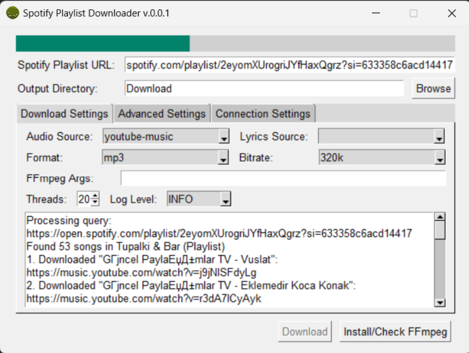

### SpotifyDL-GUI: A Python-based Graphical User Interface for Downloading Spotify Playlists

This program, SpotifyDL-GUI, leverages the power of Python and PySimpleGUI to provide an intuitive and user-friendly interface for downloading Spotify playlists. It's designed to simplify the process of downloading songs from Spotify, offering a range of customizable options such as selecting the audio source, lyrics source, format, bitrate, and more. The application also integrates with external tools like FFmpeg to handle media file conversions.

Key Features:
- Download Spotify playlists through a simple and interactive GUI.
- Choose from multiple audio and lyrics sources including YouTube, SoundCloud, and others.
- Customize download settings like format, bitrate, and output directory.
- Progress tracking with a real-time updating progress bar.
- Advanced settings for filtering results, headless operation, and cache management.
- Logging tab for monitoring download processes and actions.

The program's main GUI loop handles user interactions, capturing input data and triggering appropriate actions based on user choices. It uses threading to ensure the UI remains responsive during downloads. The `exec_command` function is a core component that executes external commands and manages output for both downloading and non-downloading processes.

Usage:
Run the script and interact with the GUI to choose playlists and download settings. The program will handle the rest, providing updates and logs directly within the GUI.

Dependencies:
- PySimpleGUI for the graphical interface.
- spotdl and FFmpeg for handling Spotify playlist downloading and media file processing.

This script represents a convenient solution for music enthusiasts looking to download and manage their Spotify playlists with ease.
